# InventoryBRO - Developer Guide

## Table of Contents
1. [Acknowledgements](#acknowledgements)
2. [Design](#design)
    * [Architecture](#architecture)
    * [UI Component](#ui-component)
    * [Parser Component](#parser-component)
3. [Implementation](#implementation)
    * [Deleting an Item](#deleting-an-item)
    * [Finding an Item](#finding-an-item)
    * [Transacting an Item](#transacting-an-item)
    * [Viewing Transaction History](#viewing-transaction-history)
    * [Storage System](#storage-system)
    * [Command Autocompletion (Trie & JLine)](#command-autocompletion)
4. [Proposed/Planned Features](#proposedplanned-features)
    * [Storage & Data Persistence](#storage--data-persistence)

---

## Acknowledgements
* **JLine3**: Used for implementing the interactive terminal, intercepting keystrokes, and providing tab-autocompletion functionality for commands.
* **PlantUML**: Used to generate the UML diagrams in this guide.

---

## Design

### Architecture
The architecture of InventoryBRO strictly adheres to Object-Oriented principles and utilizes the **Command Pattern** to decouple the parsing of user input from the execution of the application's core logic.

The main components are:
* `Ui`: Handles all interactions with the user.
* `Parser`: Interprets input and creates `Command` objects.
* `Command`: Interface implemented by all commands.
* `ItemList` / `Item`: Core data model.
* `Storage`: Handles persistence of inventory and transaction data.

**Figure 1: Overall Architecture / Class Diagram**  
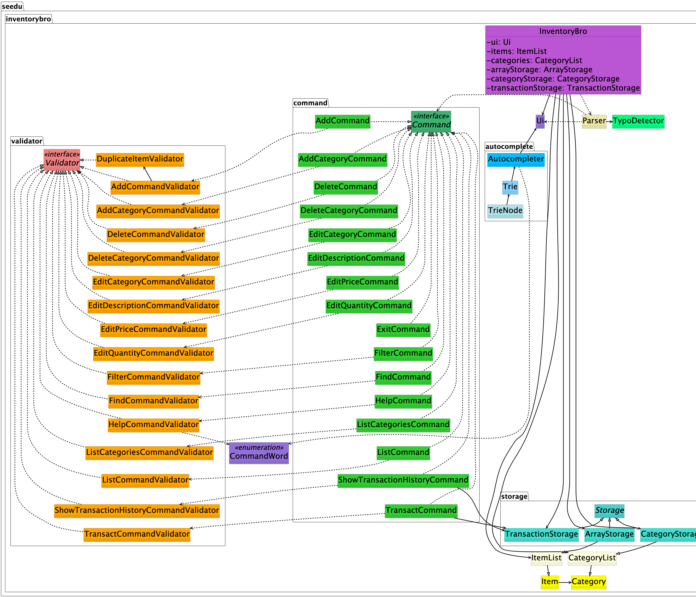

---

### UI Component
The `Ui` class acts as the bridge between the user and the internal logic.

**Figure 2: UI Class Diagram**  

**Design highlights:**
* Detects interactive vs automated mode
* Uses JLine for autocompletion
* Falls back to BufferedReader for testing

---

### Parser Component
The `Parser` is responsible for routing user input to the correct command.

**Figure 3: Parser Class Diagram**  
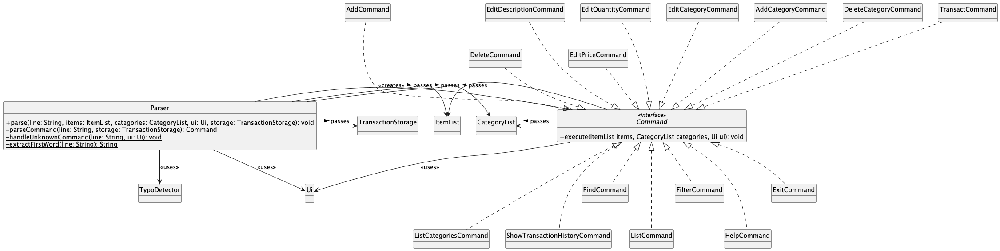

**Design highlights:**
* Uses switch-based factory pattern
* Integrates TypoDetector for suggestions

---

## Implementation

### Deleting an Item

**Figure 4: Delete Command Class Diagram**
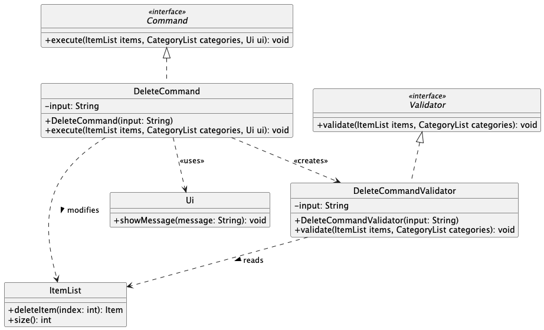

**Step-by-step Execution:**
1. When the user inputs `deleteItem 1`, the `Parser` instantiates a new `DeleteCommand` with the raw input string.
2. The `Parser` invokes the `execute(items, ui)` method on the `DeleteCommand`.
3. The `DeleteCommand` immediately creates a `DeleteCommandValidator` and calls `validate(items)`.
4. The `DeleteCommandValidator` uses Regex (`^deleteItem\s+(\d+)$`) to ensure the format is correct. If the format is invalid or the parsed index is out of bounds, it throws an `IllegalArgumentException` which halts execution.
5. If validation passes, `DeleteCommand` calculates the zero-based index and calls `deleteItem()` on the `ItemList`.
6. Finally, a success message containing the removed item's details is passed to the `Ui` to be displayed to the user.

**Figure 5: Delete Command Sequence Diagram**  
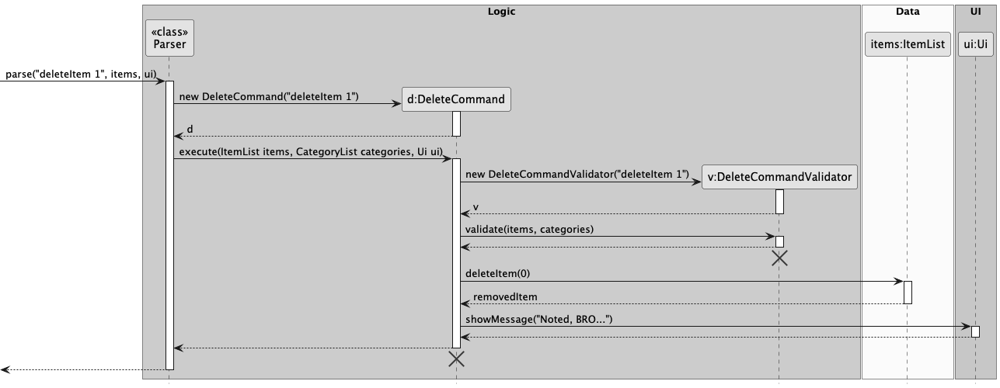

### Finding an Item

**Figure 6: Find Command Class Diagram**  
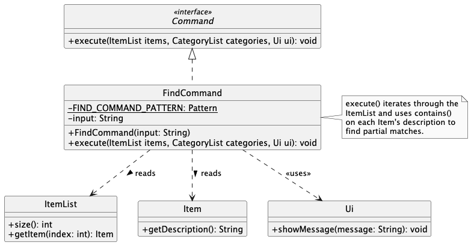

**Step-by-step Execution:**
1. When the user inputs `findItem keyword`, the `Parser` instantiates a new `FindCommand`.
2. The `Parser` calls `execute(items, ui)` on the command.
3. The `FindCommand` uses a Regex pattern (`^findItem\s+(.+)$`) to extract the search keyword. If the format is invalid, it throws an `IllegalArgumentException`.
4. The command iterates through the `ItemList`, retrieving each `Item` and checking if its description contains the target keyword.
5. Matching items are immediately passed to the `Ui` to be displayed. If no items match by the end of the loop, a "not found" message is displayed instead.

**Figure 7: Find Command Sequence Diagram**  
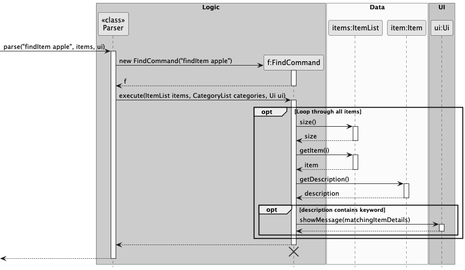

### Transacting an Item

The transact mechanism is handled by the `TransactCommand` class. It updates an item's quantity and records the transaction.

**Figure 8: Transact Command Class Diagram**  
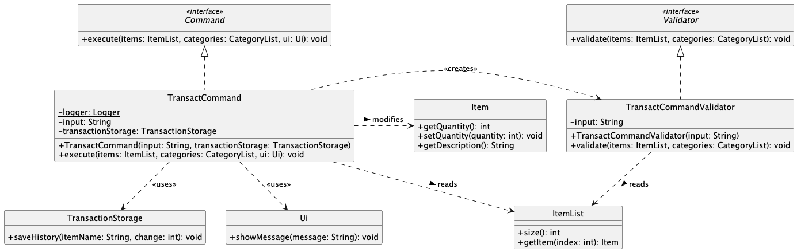

**Step-by-step Execution:**
1. User inputs `transact 1 q/-5`
2. `Parser` creates `TransactCommand`
3. `execute()` is called
4. `TransactCommandValidator` validates format and index
5. Input is parsed to extract:
    * target index
    * quantity change
6. `ItemList.getItem(index)` retrieves the item
7. Item quantity is updated
8. `TransactionStorage.saveHistory()` records the transaction
9. UI displays updated quantity

**Figure 9: Transact Command Sequence Diagram**  
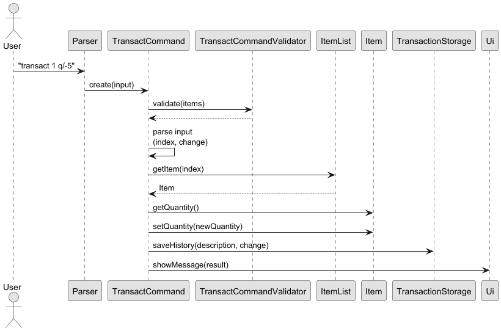

### Viewing Transaction History

The `ShowTransactionHistoryCommand` retrieves and displays all past transactions.

**Figure 10: Show History Class Diagram**  
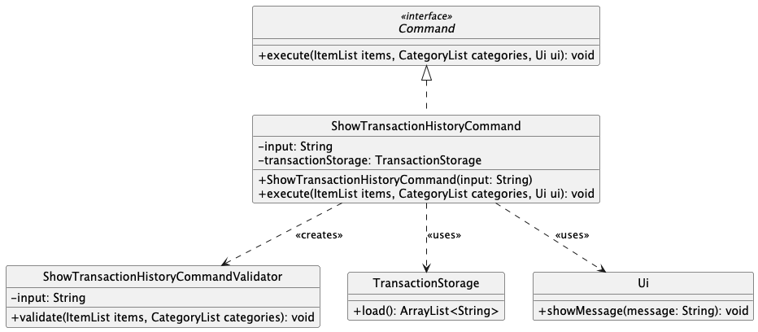

**Step-by-step Execution:**
1. User inputs `showHistory`
2. `Parser` creates the command
3. Validator checks correct usage
4. `TransactionStorage.load()` retrieves all entries
5. If empty → show message
6. Otherwise → iterate and print all entries

**Figure 11: Show History Sequence Diagram**  
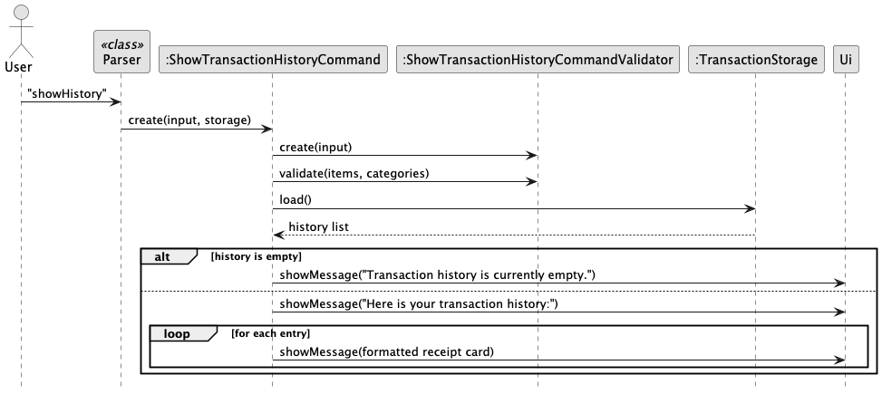

### Viewing list of items in the inventory
**Figure 12: List Command Class Diagram**
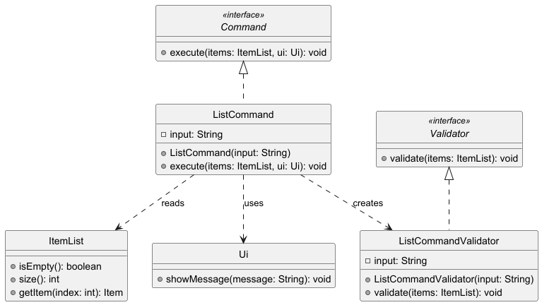

**Step-by-step Execution:**
1. When the user inputs `listItems`, the parser instantiates a new `ListCommand` with the raw input string.
2. The `execute` method of `ListCommand` is called.
3. The `execute` method creates `ListCommandValidator` with the raw input string and calls the `validate` method.
4. The `validate` method checks that the raw input string follows the correct format for `listItems` command. If the correct format is not followed, it will throw an `IllegalArgumentException` and halt the execution.
5. Control is returned to the `execute` method which checks if the inventory list is empty and passes a message that the inventory is empty to the `ui` to display to the user.
6. Otherwise, it passes the list of items in the inventory to the `ui` to display to the user.

**Figure 13: List Command Sequence Diagram**
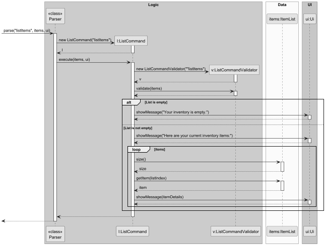

### Viewing help instructions of how to use commands
**Figure 14: Help Command Sequence Diagram**
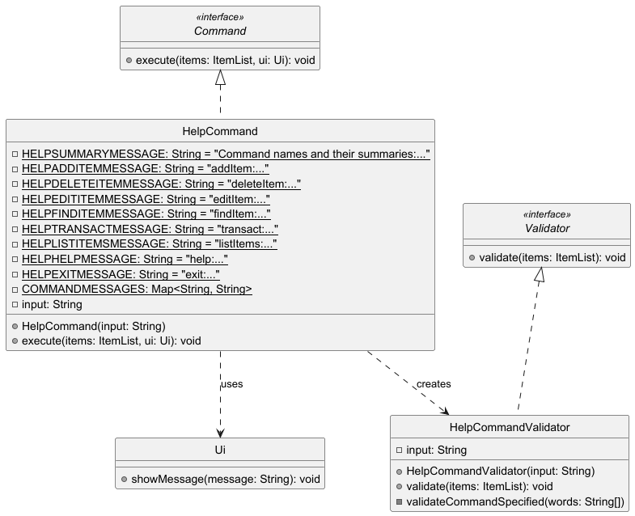

**Step-by-step Execution:**
1. The user inputs `help` or specifies a particular command and inputs `help [command_name]`.
2. The parser instantiates a new `HelpCommand` with the raw input string and the `execute` method is called.
3. The `execute` method creates `HelpCommandValidator` with the raw input string and calls the `validate` method.
4. The `validate` method checks that the raw input string follows the correct format for the `help` command. If an invalid command name is given or there are more than one command name specified, an `IllegalArgumentException` is thrown and execution is halted.
5. The `execute` method then checks the raw input string if a particular command name is specified:
    * If yes, then the detailed instruction of that particular command is passed to the `ui` to be displayed to the user.
    * If no, which means the user input is only `help`, then the command names and their summaries are passed to the `ui` to display to the user.

**Figure 15: Help Command Sequence Diagram**
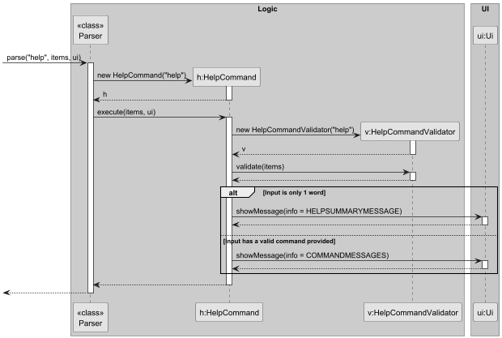

---
### Storage System

The storage system is responsible for persisting both inventory data and transaction history.

**Figure 12: Storage Class Diagram**  
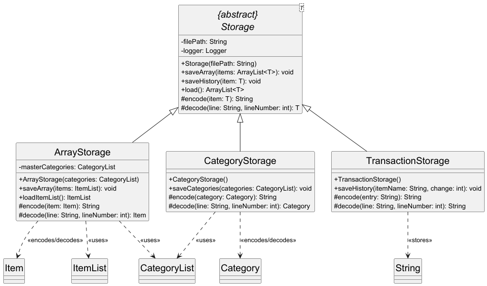

**Design breakdown:**

* **Storage (Abstract Class)**
    * Provides generic file handling
    * Defines `saveArray`, `saveHistory`, and `load`

* **ArrayStorage**
    * Handles `ItemList`
    * Converts between `Item` and string format

* **TransactionStorage**
    * Stores transaction history as strings
    * Automatically generates timestamps

**Key Design Decisions:**
* Use of generics (`Storage<T>`) for reusability
* Separation of inventory and transaction files
* Append-only strategy for transaction history

### Command Autocompletion

To enhance user experience, InventoryBRO features a robust autocompletion engine.

**Implementation Details:**
* Uses Trie for efficient prefix search
* Case-insensitive matching
* Integrated with JLine

---

## Proposed/Planned Features

### Storage & Data Persistence

Future improvements may include:
* Undo/redo functionality
* Backup and restore features

---
